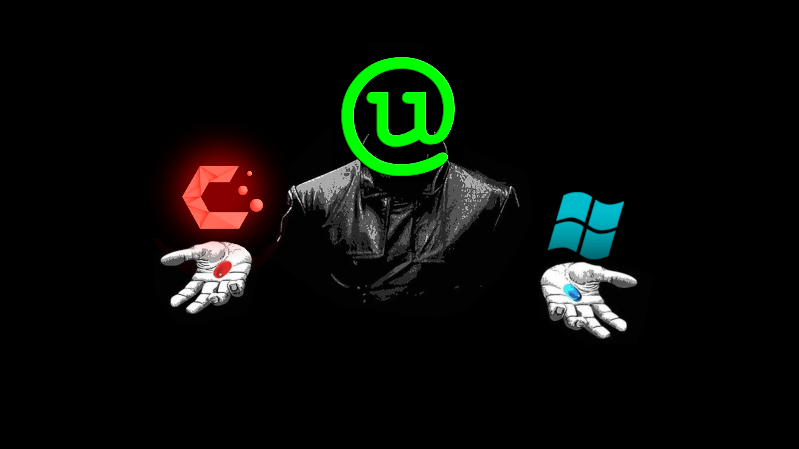

# Matrix Morpheus GRUB Theme

**Red Pill vs Blue Pill**

A minimalist Matrix-inspired GRUB theme featuring full-screen dynamic backgrounds that change between Linux and Windows.

---

Forked from [https://github.com/Priyank-Adhav/Matrix-Morpheus-GRUB-Theme](https://github.com/Priyank-Adhav/Matrix-Morpheus-GRUB-Theme)

While the icons are **arranged horizontally** on screen,  
you still navigate using the **Up** and **Down arrow keys** as in a normal GRUB menu.

---



## Installation

1. Clone the repo

```shell
git clone https://github.com/Greensky-gs/Matrix-Morpheus-GRUB-Theme
```

2. Go into the folder 

```shell
cd Matrix-Morpheus-GRUB-Theme
```

3. Make the installer executable

```shell
chmod +x install.sh
```

4. Execute the installation script as admin, either for **debian** or **cachy**

```shell
sudo ./install.sh debian
sudo ./install.sh cachy
```

5. Reboot to test your new theme

---
Optional: Simplify Your GRUB Menu

I designed this theme for a two entry layout and haven't really thought about how to visually handle the additional entries. 

If your GRUB menu currently has extra entries such as:

- “Advanced options for Arch Linux”
- “UEFI Firmware Settings”

I would recommend you remove the extra menu entries from the grub config if you don't use them.
